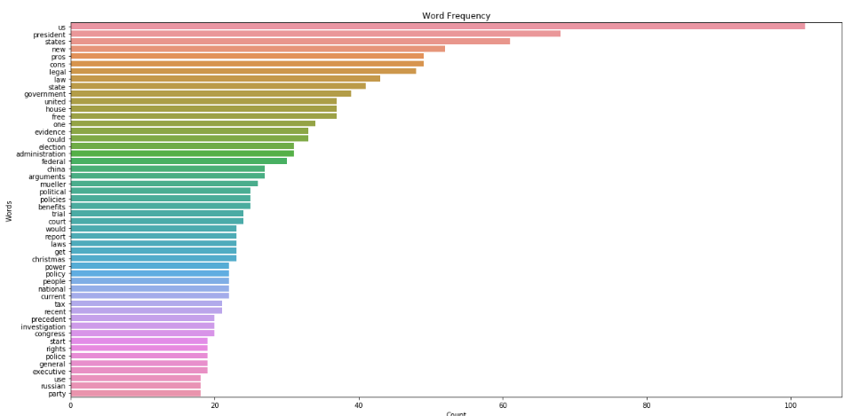
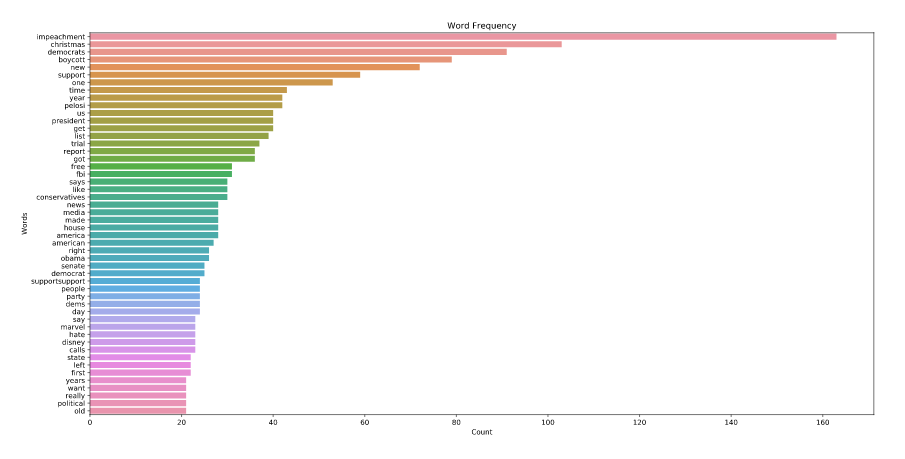
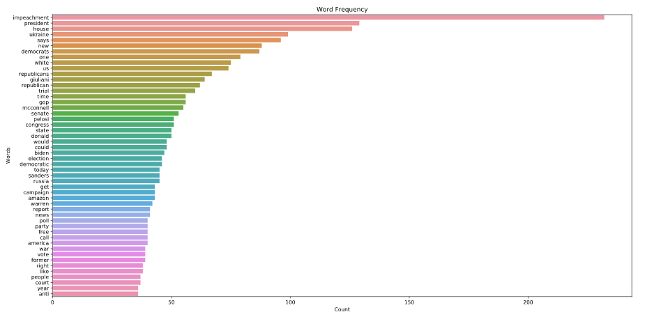
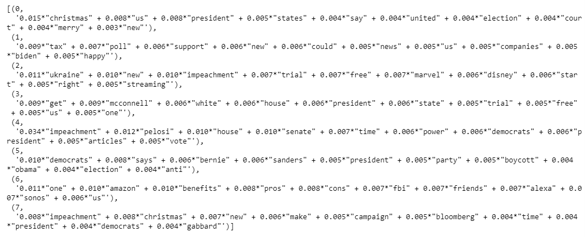

# Reddit Scraper
Throughout recent elections, the landscape of political discussion around the world has changed dramatically. Due to the increase in popularity of online forums, it has become easier for those with similar political views to find a political forum dedicated to discussions with those of similar views. However, most social media platforms and online forums differ in that they create a space where those with differing interact. As most users of such forums can understand, these discussions are rarely insightful, much less polite. While the discussions on these forums may not provide much in terms of actual political insights, what they do provide is a fascinating opportunity to research the nature of such discussions from a natural language processing point of view. One online forum that has been on the forefront of much controversy in recent years is Reddit. Reddit provides a platform for all kinds of discussion, including politics. What makes Reddit interesting is that it serves as an example of forums separated by political affiliation, as well as forums where users of all kinds of political affiliations interact with one another (I understand that there has been plenty of discussion regarding the legitimacy of Reddit discussions, but for this project, I am assuming the legitimacy of all the data I have collected). 

The structure of Reddit is simple: it is a collection of thousands of sub-forums called "subreddits", with the main page of Reddit collecting the most popular posts from the most popular subreddits. Of course, you can control the content of "your" version of the main page by simply creating an account and changing which subreddits you are "subscribed" too, however, a new user will be presented with posts from only the most popular subreddits (with some exceptions, i.e. The_Donald). Reddit currently has countless subreddits dedicated solely to political discussion, for those on both all points of the political spectrum. Some of these political subreddits are among the most popular on Reddit (i.e. r/politics, r/The_Donald, r/SandersForPresident), and these political subreddits are the basis for this project. With this project, I hoped to collect data from these political subreddits and use NLP methods to extract the differences in discussions that take place on these different subreddits (if differences can be found). 

## Project Structure
There were two angles I hoped to approach this project from:

  1. Analysis of titles
  2. Analysis of comments
  
Each post made to reddit creates its own page, and any discussion occurs within the "thread" (collection comments) contained within each post page. My reason for analyzing both titles and comments is that discussions that take place in Reddit comments are largely driven by the post title. For example, slightly editing the title of an article upon posting it to Reddit can draw out more emotion from users, and lead to a much more volatile discussion. Interestingly enough, certain subreddits have arisen that try to maintain the neutrality of their discussions. For example, the community r/NeutralPolitics removes any comments that they deem are "politicall driven". These communities are just as interesting as communities with open political affiliation, and for this reason I have included them in my data collection.

### Title analysis
Initially, I hoped to create both an exploratory and a predictive aspect of the title analysis. I hope to use TF-IDF vectorization (each words TF-IDF score is calculated by its relative frequency in all the documents of your dataset) to predict the score (number of upvotes) a title would receive based on its collection of words. However, due to the nature of a Reddit title, each page contains a small amount of text compared to comments text. For this reason, my analysis of the titles was limited to exploratory analysis.

The first task was checking out the different distribution of words by their frequency within posts to right leaning, left leaning and so called neutral subreddits. This was completed by first removing stopwords using the NLTK package (additions were made to the default stopwords set after intial visualizations). While most, if not all, sentences in the English language contain some amount of stop words, they are not important in an analysis of a political discussion. After removing stopwords, a simple wordcount revealed the following distributions for neutral, right and left leaning titles respectively:

  

After a quick glance, there is not much difference between the distributions of left leaning and right leaning titles. Some words are unique to both, such as unsurprising emphasis on impeachment related topics in the left leaning comments. Interestingly enough, the worth distribution for the titles originating from neutral subreddits does seem more "neutral". There is less emphasis on the impeachment, and the distribution does suggest a more neutral focus on politics. 

The next step in this exploratory analysis of titles was a topic modeling. If we consider that every sentence in the English language is structured around a "topic", we topic modeling aims to uncover the distribution of topics within a collection of "documents", in this case titles. The output of a topic model is a probability distribution of words over that topic, using a Bayesian statistics approach. For example, if we had topics A and B and a sentence "I will be voting for a Democrat in the next election", we can produce the probability of each word belonging to either topic A or B. In this case, I used Latent Dirichlet Allocation, which is a recursive algorithm that maps each word to a topic based on its distribution among other documents in a collection. The LDA function in Python, available through the gensim package, takes inputs of a corpus containing all the words present in a set of documents and an id2word vector, which maps each word in the corpus to a document id. Also, the user can set the number of topics they hope to map, as well as the number of recursive "passes" to make over the data. In this case, the number of topics does not always guarantee incrementally imporve results, but more passes generally does produce more robust topics and much longer computation times. Since there was not much title text data, I chose 8 topics with 1500 passes, which produced the following topics and [LDA visualization](https://htmlpreview.github.io/#topic=0&lambda=1&term=):

